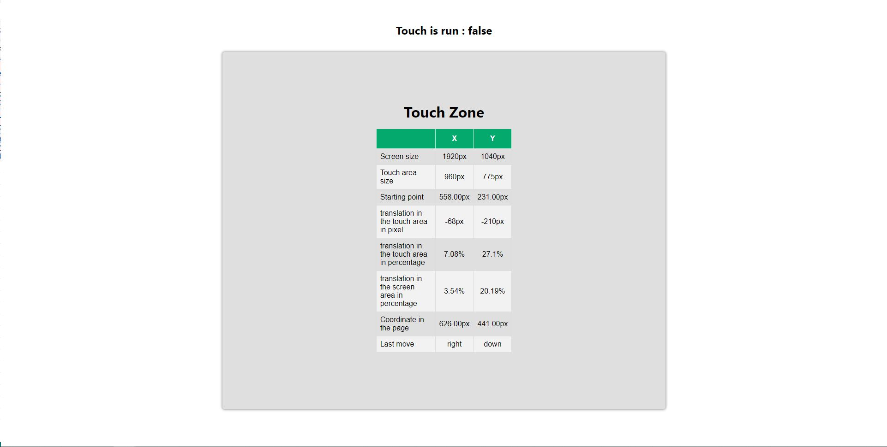

# Hooks React useTouchEvent 
[Live demo, hosting with Netlify](https://usetouchevent.netlify.app/)

<br>

# About

UseTouchEvents is a hook for your React components. It allows to retrieve the different coordinates and values ​​when the user interacts with his device either with his finger on a smartphone or with the mouse for a desktop PC.

Axe d'amélioration :

- Detecter des formes dessinés determiner (cercle, carré, triangle...)




<br>

# Features

- Detect touch event
- Define X and Y position of the touch event (origin and movement)
- Know the direction of the movement made by the user
- Know the distance traveled
- Know the distance traveled in percent in the element targeted and the screen
- Disabled when two fingers touch the screen
- Mouse compatibility.

<br>

# Documentation

This hooks return an object contenant there value.

```javascript

    //Dimension of target element in PX
    size_X: 0,
    size_Y: 0,

    //Dimension of screen in PX
    screen_X: 0,
    screen_Y: 0,
    // Define if the toucheEvent is trigger
    start: false,
    //Coordinate when the touch event beging.
    start_X: 0,
    start_Y: 0,

    //Coordinate of user movement
    move_X: 0,
    move_Y: 0,

    //Distance traveled in the target in pixels
    translate_X: 0,
    translate_Y: 0,

    //Distance traveled in the target in percent
    percent_X: 0,
    percent_Y: 0,

    //Distance traveled in the screnn
    percent_PageX: 0,
    percent_PageY: 0,

    // Direction of movement : left && top || left && bottom || right && top || right && bottom
    direction_X: "Stand by",
    direction_Y: "Stand by",

```
<br>

# Use

Import, call the hooks in your component , instantiate a ref and bind dom element to hooks

```javascript

function Component(){
    const refTouch = useRef(null);
    const { onTouch } = useHooks_Touch_event(refTouch);


    //bind dom element to hooks
    <div ref={reTouch}>
        {...}
    </div>
}

```